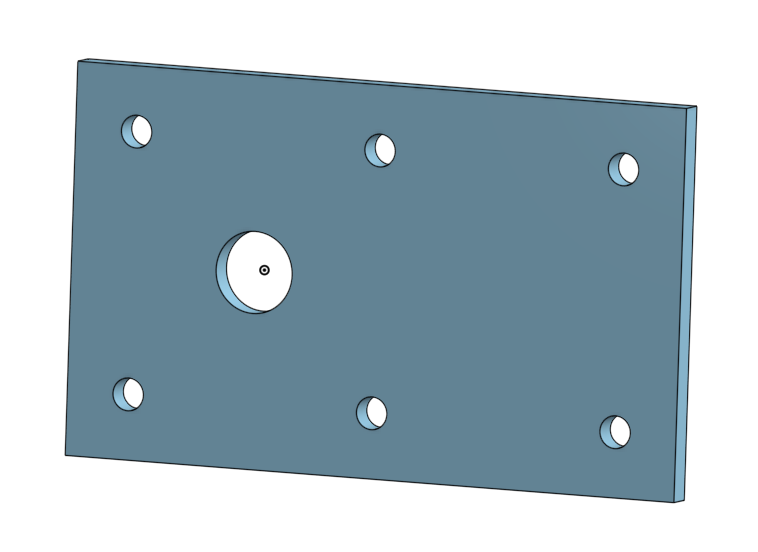

# BasicCAD Journal

## Sam Funk

---
## Table of Contents
* [Table of Contents](#Table-of-Contents)
* [Base](#Base)
* [Mount](#Mount)
* [Fork](#Fork)
* [Tire](#Tire)
* [Wheel](#Wheel)
* [AxleCollarBearings](#AxleCollarBearings)

## Base

### Description

The first assignment is to create the caster base.  The base's dimensions are 200 mm x 120 mm and 8 mm thick.  It has 6 holes 10 mm wide and 20 mm from the edge equally spaced along the edges.

### Evidence
[Castor Onshape Document](https://cvilleschools.onshape.com/documents/5aa391eca7bc241b822299c0/w/1baa1d3840cea60709942087/e/860635ff4679e140264c4e3d)

### Image

### Reflection

While completing this part I learned how to:
* sketch
* extrude/remove
* use linear patterns
* use dimensions

---

## Mount

### Description

### Evidence

### Image

### Reflection

---

## Fork

### Description

### Evidence

### Image

### Reflection

---

## Tire

### Description

### Evidence

### Image

### Reflection

---

## Wheel

### Description

### Evidence

### Image

### Reflection

---

## AxleCollarBearings

### Description

### Evidence

### Image

### Reflection
