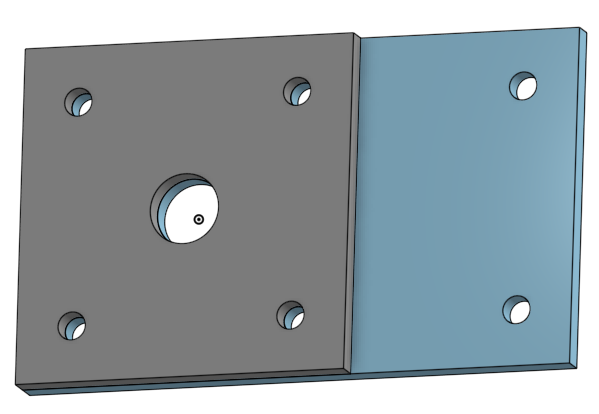

# BasicCAD Journal

## Sam Funk

---
## Table of Contents
* [Table of Contents](#Table-of-Contents)
* [Base](#Base)
* [Mount](#Mount)
* [Fork](#Fork)
* [Tire](#Tire)
* [Wheel](#Wheel)
* [AxleCollarBearingsWasher](#AxleCollarBearingsWasher)
* [WheelAssembly](#WheelAssembly)

## Base

### Description

The first assignment is to create the caster base.  The base's dimensions are 200 mm x 120 mm and 8 mm thick.  It has 6 holes 10 mm wide and 20 mm from the edge equally spaced along the edges.

### Evidence
[Castor Onshape Document](https://cvilleschools.onshape.com/documents/5aa391eca7bc241b822299c0/w/1baa1d3840cea60709942087/e/860635ff4679e140264c4e3d)

### Image

### Reflection

While completing this part I learned how to:
* sketch
* extrude/remove
* use linear patterns
* use dimensions

---

## Mount

### Description

The second assignment is to create the caster mount. The mount's dimensions are 120 mm x 120 mm and 8 mm thick. It has 4 symmetric holes in the corners, 10mm in diameter, 20mm from each side and another 25 mm circle in the center.

### Evidence
[Castor Onshape Document](https://cvilleschools.onshape.com/documents/5aa391eca7bc241b822299c0/w/1baa1d3840cea60709942087/e/860635ff4679e140264c4e3d)

### Image

### Reflection

While completing this part I learned how to:
* extrude a new part
* sketch a center point rectangle
* create multiple parts in one part studio

---

## Fork

### Description

The third assignment is to create the caster fork. The fork is an 80mm circle with a 60mm shaft on one side and two 75mm tabs on the other. The two tabs have a 10mm hole through them for the axle to pass through.

### Evidence

[Castor Onshape Document](https://cvilleschools.onshape.com/documents/5aa391eca7bc241b822299c0/w/1baa1d3840cea60709942087/e/1b707da0b9ad8629b73c418e)

### Image

### Reflection

While completing this part I learned how to:
* use fillets
* use chamfers
* extrude a hollow cylinder 

---

## Tire

### Description

The fourth assignment is to create the caster tire. The tire is a trapezoid revolved around a central axis to create a loop. The edges are broken using the fillet tool.

### Evidence

[Castor Onshape Document](https://cvilleschools.onshape.com/documents/5aa391eca7bc241b822299c0/w/1baa1d3840cea60709942087/e/473ad4590c6f2f3fd6d4da69)

### Image

### Reflection

While completing this part I learned how to:
* draw a diameter dimension
* make a sketch symmetrical
* make an angled dimension
* use the revolve feature

---

## Wheel

### Description

The fifth assignment is to create the caster wheel. It is a simple sketch revolved around an axis with five cutouts. It must fit perfectly inside the tire.

### Evidence

[Castor Onshape Document](https://cvilleschools.onshape.com/documents/5aa391eca7bc241b822299c0/w/1baa1d3840cea60709942087/e/473ad4590c6f2f3fd6d4da69)

### Image

### Reflection

While completing this part I learned how to:
* use a circular pattern
* make two parts in one studio
* use arcs

---

## AxleCollarBearingsWasher

### Description

The last four parts are the axle, collar, bearing, and washer. The axle and collar were created together in one parts studio, the bearing was extruded from the wheel, and the washer was created separately.

### Evidence

[Castor Onshape Document](https://cvilleschools.onshape.com/documents/5aa391eca7bc241b822299c0/w/1baa1d3840cea60709942087/e/473ad4590c6f2f3fd6d4da69)

### Images

### Reflection

While completing this part I learned how to:
* extrude symmetrically
* use geometry from other sketches

---

## WheelAssembly

### Description

The lower sub-assembly for the castor contains the wheel, tire, axle, and two bearings. It uses fastened mates and revolute mates to allow for motion.

### Evidence

[Castor Onshape Document](https://cvilleschools.onshape.com/documents/5aa391eca7bc241b822299c0/w/1baa1d3840cea60709942087/e/30392e3f8be3ef84ae923f07)

### Images

### Reflection

While completing this assembly I learned how to:
* make an assembly
* use fastened mates
* use revolute mates
