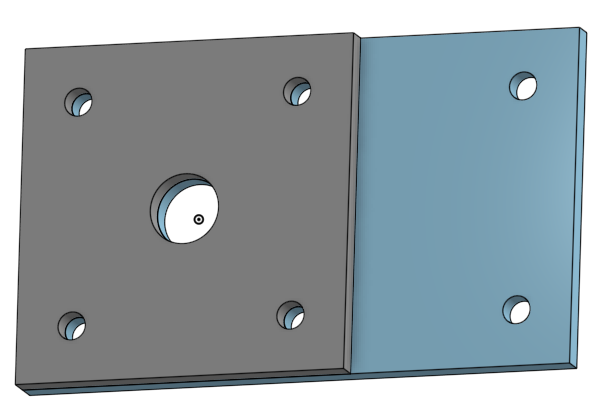

# Sep. 29

## Mount - Castor

While completing this part I learned how to:
* extrude a new part
* sketch a center point rectangle
* create multiple parts in one part studio

[Castor Parts Studio](https://cvilleschools.onshape.com/documents/5aa391eca7bc241b822299c0/w/1baa1d3840cea60709942087/e/860635ff4679e140264c4e3d)

